# 5 缓存 | Cache

## 5.1 Memory Hierarchy Introduction
众所周知，指令和数据都需要在 memory 里才能访问。而访问 memory 比较慢。

关注到程序对 memory 的访问有如下特点：

   - **Temporal locality**, 时间局部性，即近期访问的项目很有可能会在短时间内再次被访问。例如循环中的指令、induction variables (循环中用来计数的变量) 等
   - **Spatial locality**, 空间局部性，即近期访问项目附近的项目也有可能会在短时间内再次被访问。例如连续的指令执行，或者数组变量等

因此，结构化的 memory 被设计出来。近期访问到的内存单元和它附近的内容被复制一份放在离 CPU 更近、访问更快，但也更小的 **cache** 中，从而利用上述局部性加速访问。

我们称复制的单位是 **block** 或者 **line**，它通常是 2 的若干次方个 word 那么大（一个 word 是 4 Byte）。

如果我们希望访问的内存单元 (即，它所在的 block) 恰好在 cache 中（之前某一次被搬上来了），我们称之为一次 **hit**，这时我们只需要从中读出来就可以了。判断是否 hit，以及读出来的时间称为 **hit time**。

如果并不存在，称为一次 **miss**。当 cache miss 时，我们需要先将内容所在的 block 从 memory 拿到 cache，然后再将内容读到处理器；这个过程花的时间成为 **miss penalty**。

对应的有 hit / miss rate (也称 ratio) 的概念，不再赘述。

## 5.2 The basics of Cache
下面我们来具体考虑 cache 怎么实现。主要需要讨论的问题是：如何知道一个 block 是否在 cache 里？以及如果知道它在的话，如何找到它？

### 5.3.1 Direct Mapped Cache

如上图所示，内存有 32 个 block，其编号 (block address) 分别为 00000 到 11111；cache 有 8 个 block。Direct mapped cache 这种方式直接按 block address 的后 3 位确定它应该放在 cache 的哪个 block 里。

即，图上灰色的 block 的编号末 3 位都是 001，所以就应该放在 cache 中编号为 001 的灰色 block 里；橙色同理。

为什么是三位呢？很简单，因为 cache 有 8 个 block 的话，其对应的就是 3 位二进制数。我们把这个决定映射关系的末几位称为 **index**。同理，如果 cache 有 64 个 block 的话，index 就是 6 位。Cache 的 block 数始终是 2 的幂次方。

那么我们如何确定放在 cache 中编号为 001 的位置的 block 究竟是 00001，还是 01001，还是其他的哪个 block 呢？我们可以通过在 cache 中额外存放这个 block 的 block address 来知道这个问题。

当然，实际上我们只需要存放这个 block address 的前若干位，因为后面的几位已经通过 index 来确定了。例如图上的例子中，10001 存在 index 为 001 的 cache block 中，只需要额外存开头的 10 即可。我们把用来判定某个 cache block 中到底存的是哪个 memory block 的这几位称为 **tag**。

下一个问题是，如何确定 cache 中的这个 block 是否有效呢？也就是说，任何时候这个 block 中总有一个值，但是假设这个值是启动的时候自带的，那么访问它就会发生错误，因为它实际上并不是对应的 memory block 的值。因此，我们引入一个 **valid bit** 来表示这个 block 是否有效；初始值为 0 表示无效，当有一次将 memory 的一个 block 拿进来之后就将其置为 1。

也就是说，cache hit 当且仅当 valid bit 是 1 而且 tag 是一致的。

我们在内存中的地址都是以字节为单位的，而上面我们讨论的 block address 都是以 block 为单位的，这两者之间有什么样的关系呢？非常简单，由于一个 block 总是 2 的若干次方个 word 那么大， 而每个 word 是 4 Byte，因此每个 block 的 byte 数也是 2 的若干次方。因此，我们只需要去掉 byte address 的后几位，就可以获得它的 block address 了。这样相邻的 2 的若干次方个 byte 就会聚合成一个 block 了，因为它们的 byte address 的前若干位，即 block address，是相同的。

也就是说，我们将 byte address 分为 2 个部分：block address 和 byte offset，即所在 block 的编号以及在 block 中的偏移量 (in byte)；而 block address 又分为了两个部分，即 tag 和 index。即：

而在 cache 中，我们存储以下信息：

即，每个 cache block 有一个 index，当出现一次 miss 后从内存中拿所需内存覆盖到对应的 index 条目上的 data 字段，将 tag 设为 block address 的前几位，将 valid bit 设为 1。

???+ example "例 5.1 Direct Mapped Cache 的填充和替换"
	下面是一个具体的例子：
	
    
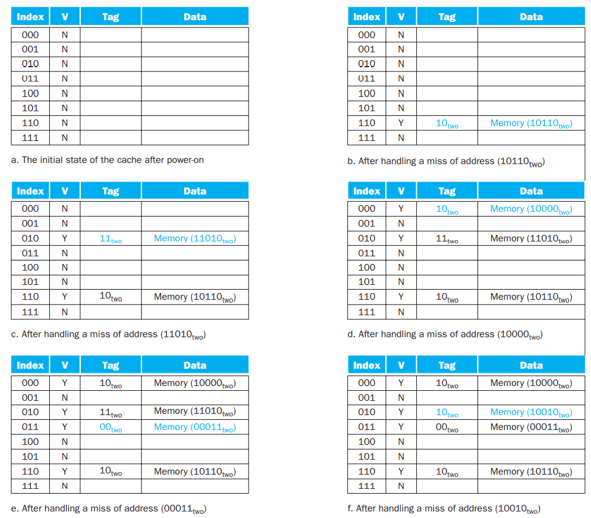

???+ example "例 5.2 Direct Mapped Cache 的位数计算和连线方式"
	又例如，对于一个 64 位地址的机器，cache 的大小为 1024 个 block，一个 block 有 1 个 word，即 4 个 byte，那么 index 的位数就是 $\log_2 1024 = 10$，byte offset 的位数就是 $\log_2 4 = 2$，因此 tag 的位数就是 $64 - 10 - 2 = 52$；另外一个 block 的大小是 4 个 byte，即 32 位，因此一个 cache 的条目的位数就是 valid bit 1 位 + tag 52 位 + word 32 位 = 85 位。

	（index 并不需要在这里被计算，因为 index 之于 cache 就像 address 之于 main memory 一样，是直接用来访问的）

	亦即：
	
    

	当然，如我们之前所说，一个 block 有可能包含多个 word，而每次实际上只会访问出一个 word。因此这时我们还需要在 block 中选择对应的 word，这时候我们就可以将 byte offset 进一步细分成表示 block 中某个 word 的 **block offset**（为什么不叫 word offset 呢？），以及表示 word 中某个 byte 的 **byte offset**：
	
    
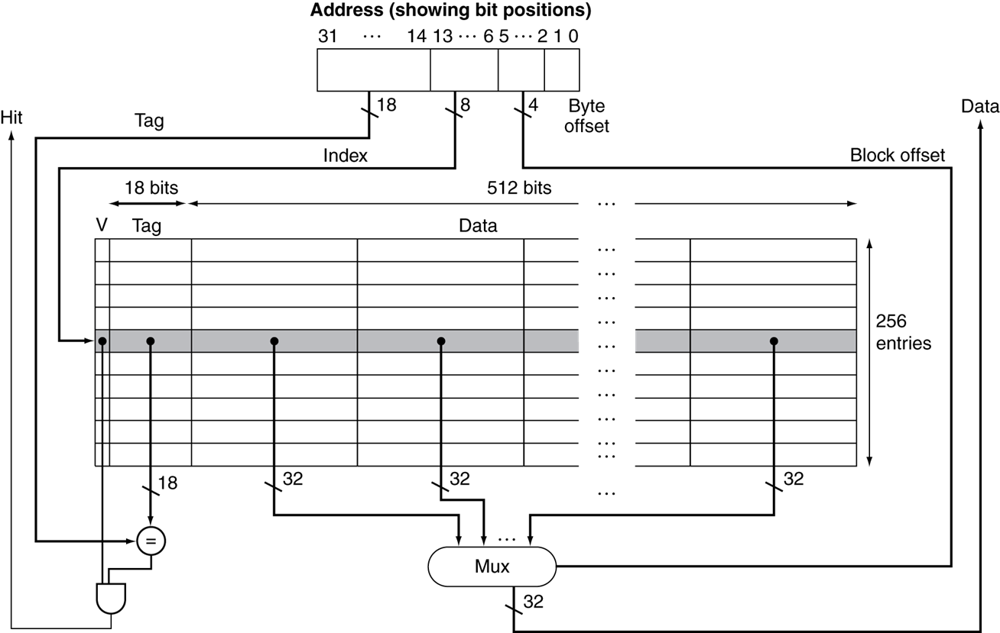

	即，对这个图中的情形，地址是 32 位的，一个 block 有 16 个 word，有 256 个 cache entry。因此 byte offset 的位数是 $\log_2 4 = 2$，block offset 的位数是 $\log_2 16 = 4$，index 的位数是 $\log_2 256 = 8$，tag 的位数是 $32-8-4-2=18$，一个 cache entry 的长度是 valid bit 1 位 + tag 18 位 + data 16 word * 4 byte/word * 8 bit/byte = 531 位。

???+ example "例 5.3 Direct Mapped Cache 的位数计算"
	再例如：
	
    
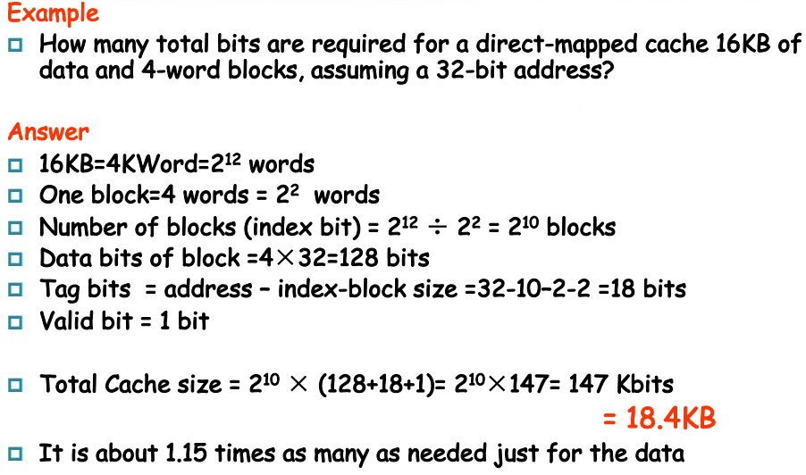

### 5.3.2 Handling Cache Hits & Misses
显然，读和写的时候发生 cache miss 的处理方式是不一样的；另外读也有读数据和读指令之分（指令 cache 和数据 cache 通常是分离的）。我们分别对其进行讨论：

- **Read**
    - **Hit**
        - 直接从 cache 里读就好了
    - **Miss**
        - **Data cache miss**
            - 从 memory 里把对应的 block 拿到 cache，然后读取对应的内容。
        - **Instruction cache miss**
            - 暂停 CPU 运行，从 memory 里把对应的 block 拿到 cache，从第一个 step 开始重新运行当前这条指令。
- **Write**
    - **Hit** 有两种可以选的方式：
        - **write-through**，即每次写数据时，既写在 cache，也写在 main memory。这样的好处是 cache 和 main memory 总是一致的，但是这样很慢。
            - 一个改进是引入一个 **write buffer**，即当需要写 main memory 的时候不是立即去写，而是加入到这个队列中，找机会写进去；此时 CPU 就可以继续运行了。当然，当 write buffer 满了的时候，也需要暂停处理器来做写入 main memory 的工作，直到 buffer 中有空闲的 entry。因此，如果 main memory 的写入速率低于 CPU 产生写操作的速率，多大的缓冲都无济于事。
        - **write-back**，只将修改的内容写在 cache 里，等到这个 block 要被覆盖掉的时候将其写回内存。这种情况需要一个额外的 **dirty bit** 来记录这个 cache block 是否被更改过，从而直到被覆盖前是否需要被写回内存。由于对同一个 block 通常会有多次写入，因此这种方式消耗的总带宽是更小的。
    - **Miss** 同样有两种方式：
        - **write allocate**，即像 read miss 一样先把 block 拿到 cache 里再写入。
        - **write around** (or **no write allocate**)，考虑到既然本来就要去一次 main memory，不如直接在里面写了，就不再拿到 cache 里了。
        - write-back 只能使用 write allocate；一般来说，write-through 使用 write around，其原因是明显的。

### 5.3.3 其他定位方式
在 5.3.1 中，我们讨论了最简单的映射方式，即直接映射：对于任一给定的 block address，有且仅有一个 cache block 可供它存放。实际上，还有一些其他的映射方式。

**Fully associative**，简单来说就是 block can go anywhere in cache。这种方式的好处是可以降低 miss rate，坏处是每次需要跟所有 block 比较是否 hit：

这种情况下，我们需要额外讨论替换时采用什么样的策略；即：替换哪一块。通常有三种策略：

- **Random replacement**，随机挑选一个幸运 block 覆盖掉（需要一个随机数生成器）
- **LRU, Least Recently Used**，选择上一次使用时间距离现在最远的那个 block 覆盖掉（需要一些额外的位用来记录信息，具体实现没有讲）
- **FIFO, First In First Out**，选择进入时间最早的 block 覆盖掉（同样需要一些额外的位记录信息，同样没讲具体实现）

介于 direct mapping 和 fully associative 之间的是 set associative，即每个 block 仍然会根据其 address 确定其可以存放的 cache block，但是可以放的地方并不是一个，而是一组。即：

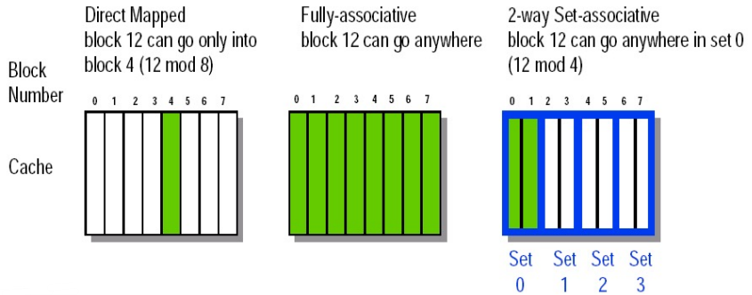

最右边是一个 2-way set-associative 的例子，每个地址对应 cache 中的一组，在这里一组有两个 cache block。因此在访问时也需要分别比较这两个 block 是否 hit。在替换时也需要决定替换哪一块，也可以使用前述的三个策略中的一个实现。

相似地，一个 4-way set-associative 的访问中判断 hit 和获取 data 的连线如下：

所以，事实上，direct mapping 和 fully associative 其实都是 set associative 的特例：direct mapping 其实就是 1-way set associative，而 fully associative 就是 n-way set associative，其中 n 是 cache block 的个数；我们称一组的大小为 **associativity**，那么这两种方法的 associativity 就分别是 1 和 n。

显然，在查看所需 block 是否在 cache 中时，需要访问的 cache block 个数就等于 associativity，即：

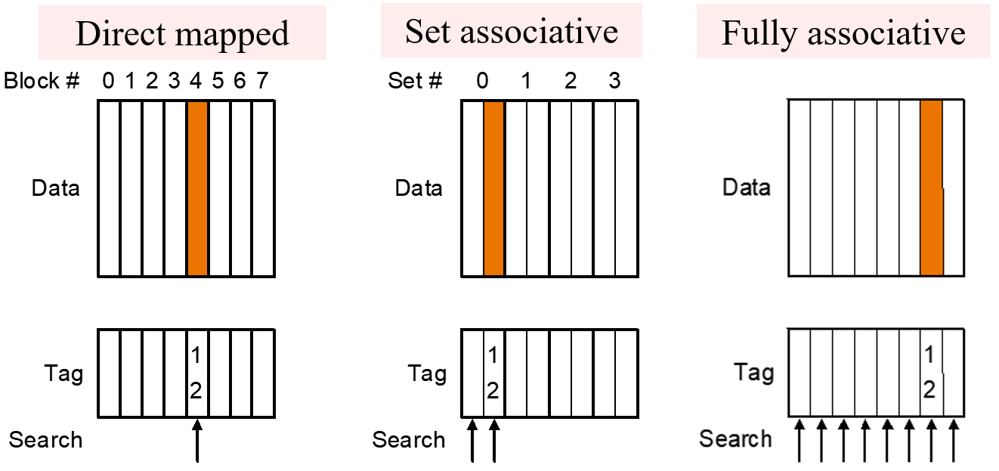

???+ example "例 5.4 Set associative 的位数计算"
	已知 Cache size is 4K Block, Block size is 4 words, Physical address is 32bits，求 direct-mapped, 2-way associative, 4-way associative, fully associative 时 tag 和 index 的位数。
	
	即求 associativity 为 1, 2, 4 和 4096 时 tag 和 index 的位数。
	
	我们知道，在 direct-mapped 中 index 是用来确定 memory block 放在哪个 cache block 中的，那么在 set-associative 中，index 就是用来确定放在哪个 set 中的。因此，index 的位数就对应着 set 的个数，即：
	
    $$\text{index}_\# = \log_2(\text{set}_\#) = \log_2\frac{\text{cache block}_\#}{\text{associativity}}$$

	因此 associativity 为 1, 2, 4, 4096 时，index 的位数分别是 12, 11, 10, 0。
	
	由于 block size 为 4 words，即 16 Bytes，因此 byte offset 需要 4 位（或者，具体地说，block offset 2 位，byte offset 2 位）。所以剩下的都是 tag 了，因此 tag 的位数分别是 16, 17, 18, 28。

???+ example "18 - 19 Final"
	
    
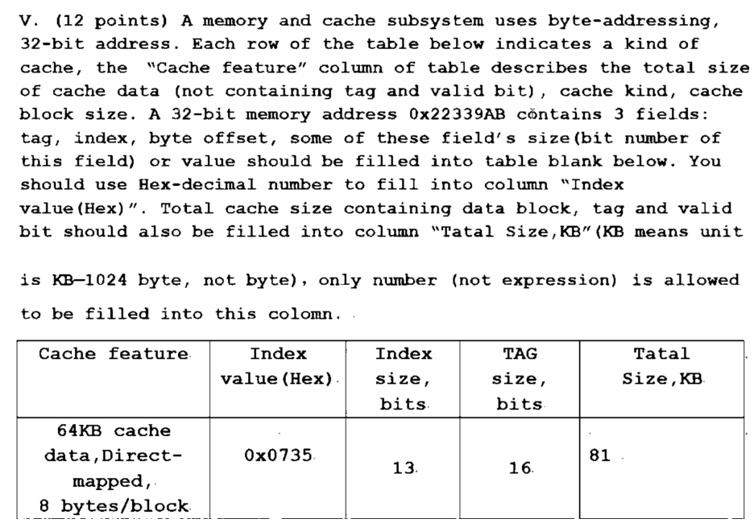

	
    
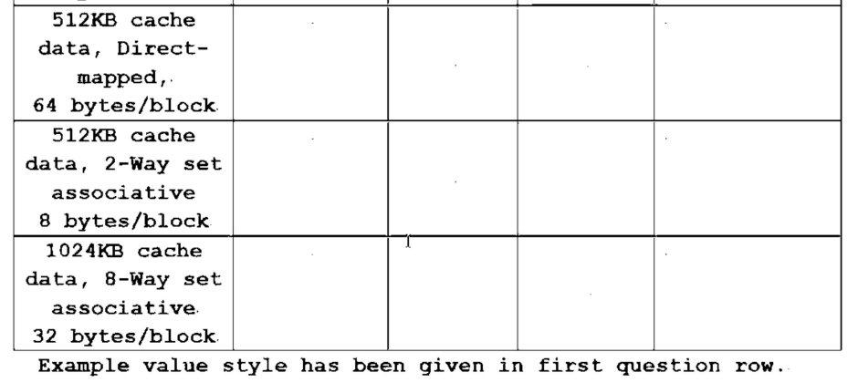

	??? info "答案"
        
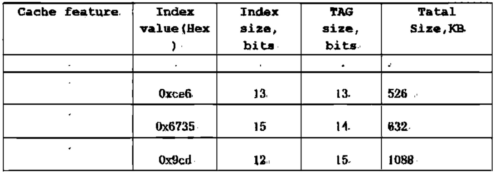

## 5.3 Measuring Cache Performance
再说吧

## 5.4 Virtual Machines
先不学了

## 5.5 Virtual Memory

### 5.5.1 虚拟内存技术
计组把 main memory 描述为 secondary storage (即 disk) 的 "cache"。或者，反过来说，我们把那些在 main memory 里放不下的内容存到 disk 里（这样更能符合我们熟悉的“可执行文件必须加载到内存才能运行”的一贯认知）。这种技术称为 **virtual memory**。

虚拟内存技术可以让多个程序之间高效、安全地共享内存，同时允许单个程序使用超过内存容量的内存（正如虽然 CPU 取数据时是从 cache 中取的，但是它能访问到的数据的数目比 cache 的容量要大）。在远古时期，很多程序因为需要使用过大的内存而无法被运行；但现在由于虚拟内存技术的广泛使用，这些程序都不成问题了。

如下图所示，实际上的 main memory（我们称之为 **物理内存, physical memory**）中的地址称为 **物理地址, physical addresses**；而我们给每一个程序内部使用到的内存另外编一套地址，称为 **虚拟地址, virtual addresses**；虚拟内存技术负责了这两个地址之间的转换 (**address translation**，我们稍后再讨论转换的方式)：

从这张图中我们也可以很容易地看出“虚拟内存技术可以允许单个程序访问超过物理内存大小限制的内存”的原因，即有一些内存可以被临时地存放在磁盘上，到被访问的时候再被放到 physical memory 中，就像 cache 做的那样。

从这张图中，我们还可以注意到 physical memory 的存放并没有分组的概念，即用 cache 的术语来说，main memory 是 fully-associative 的。

虚拟存储的技术和 cache 的原理是一样的，但是一些术语的名字并不相同。对应于 cache 中的 block / line，虚拟存储的内存单元称为 **page**，当我们要访问的 page 不在主存中而是在磁盘里，也就是 miss，我们称之为一次 **page fault**。

??? info
    在一些地方，virtual page 称为 page，physical page 称为 **帧, frame**；我们的课本并未采用这种称呼。但无论如何，在看到单独出现的 _page_ 时，应当参考上下文判断它是 virtual 还是 physical。

    在一些地方，virtual address 也被称为 logical address。

### 5.5.2 如何完成映射呢
首先我们要考虑的一个问题就是，一个 page 应该有多大。我们知道，访问磁盘相比于访问内存是非常慢的（相差大约十万倍），这个主要时延来自于磁盘转到正确的位置上的时间花费；所以我们希望一次读进来多一点从而来分摊这个访问时间。典型的 page 大小从 4KiB ~ 64KiB 不等。

下面我们考虑映射关系。我们不妨假设一个 page 的大小是 4KiB，那么其页内的偏移 **page offset** 就需要 12 位来表示；那么物理地址中除去后 12 位以外前面的部分就表征着它是属于哪一页的，我们称之为 **physical page number**。

??? info
	如我们之前所说，memory 作为 disk 的 "cache" 是 fully-associative 的，因此 physical page number 其实就是 cache 中的 "tag"，而 page offset 就是 cache 中的 "byte offset"，fully-associative 的 cache 并没有 index 这一字段。

为什么要使用 fully-associative 的存储方式呢？我们在 cache 中讨论过，这种方式的好处是失效率低，坏处是查询难度大。但是我们也讨论到了，page fault 的开销是非常大的，因此比较低的 page fault 的概率相对于额外的查询来说是非常划算的。

同样，由于读写磁盘是非常慢的，write through 的策略并不合适，因此在 virtual memory 的技术中，我们采取 write back 的方式。

而 virtual address 的形式与之类似，由若干位 page number 和若干位 page offset 组成。

我们之前提到，我们有一种方式可以找到 virtual page 对应的 physical page，因此当我们要访问一个虚拟地址时，将其 virtual page number 通过这种 translation 转换为 physical page number（这种 translation 也会负责 page fault 的处理并给出正确的转换），而 page offset 表示的是在一页内的偏移，保持不变即可。这样我们就获得了这个 virtual address 对应的 physical address，也就是它在实际的 main memory 中存储的位置。如下图所示：

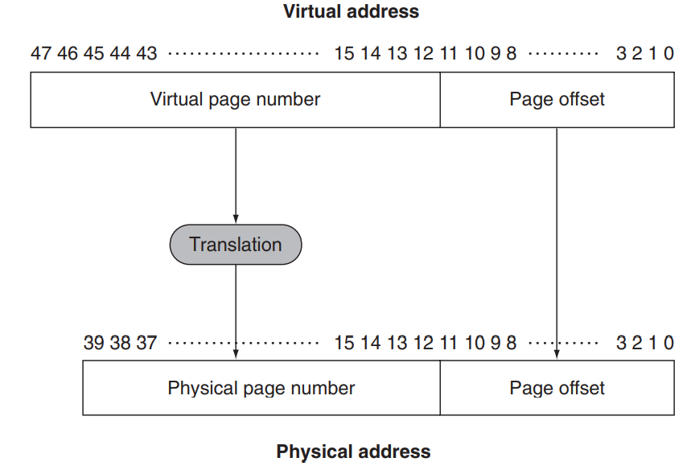

同时也可以看出，virtual page number 的位数比 physical 的多；这也是显然的，因为我们引入虚拟内存的一个重要原因就是为了使用比 main memory 更大的内存。

??? info
	如果我们把 translation 看成一个函数（事实上，我们之后可以看到，这种 translation 确实符合函数的定义），那么事实上 virtual page number 到 physical page number 的转换是 direct mapped 的，因为我们从一个 virtual page number 可以确切地找到 **一个** physical page number，而不是在一组中再去寻找。因此，virtual page number 实际上对应了 cache 中的 "index"，tag 并不需要。

	所以说，我们认为 virtual address 之于 physical address 是 direct mapped 的，virtual page number 对应 cache 中的 index，page offset 对应 byte offset；而 physical address 之于 secondary storage 是 fully associative 的，physical page number 对应 cache 中的 tag，page offset 对应 byte offset。
	
	（但是实际上，我个人并不认同把 virtual memory 和 cache 类比起来。）

### 5.5.3 页表
我们下面讨论这种 translation 的具体方案。之前也提到，fully-associative 的一个重要问题就是如何去定位某一项；这里我们引入 **page table** 这种结构，它被存放在 main memory 中，每个程序（实际上是进程，但是写课本的人好像现在并不想引入这个概念）都有一个自己的 page table；同时硬件上有一个 **page table register** 保存当前进程这个页表的地址。

使用页表时，我们根据 virtual page number 找到对应 **page table entry, PTE** 在 page table 中的偏移，然后与 page table register 相加得到对应 entry 的 physical address，从中读取对应的 entry。其实就是说，page table 就是一个数组， `page_table[i]` 表示第 `i` 个 virtual page 对应的 physical page number。

如下图所示，每个 entry 中包含了一个 valid bit 和 physical page number。如果 valid bit = 1，那么转换完成；否则触发了 page fault，handle 之后再进行转换。

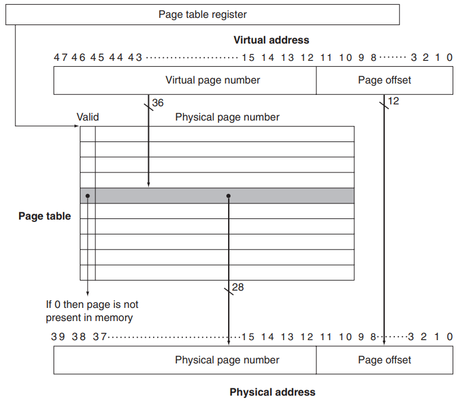

Page fault 会引发一个 exception，由操作系统接管控制，处理完之后再将控制交还给进程。操作系统要做的事情是在 secondary storage 中找到这一 page，将其放到 main memory 里（可能需要与当前主存中的某个 page 交换），然后更新 page table。

操作系统在创建进程时在 disk (或者 flash memory) 上创建一个虚拟地址空间那么大的空间，以便上述的交换；这个空间称为 **交换区, swap space**。下面的问题是操作系统如何在 swap space 中找到需要的 page。

我们可以看到，如果 page table entry 的 valid bit 为 0，那么后面的 physical page number 是没有用到的。我们可以利用这个字段存储对应 page 被交换到了 disk 的哪个位置；或者另外开辟一个索引结构，在其中记录每个 virtual page number 对应的 disk 位置。作为前者的一个例子，请看下图：

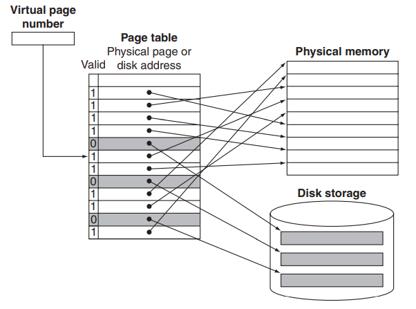

操作系统还会跟踪哪些进程和虚拟地址正在使用哪个物理页，因为操作系统需要让交换引发后续 page fault 的次数尽可能少。操作系统会使用我们之前提到的 **LRU, Least Recently Used** 的策略处理交换。

LRU 的代价有点太大了，毕竟如果使用 LRU 的话需要遍历整个 main memory。因此，很多操作系统引入了 **reference bit** (或者称为 **use bit**) 来近似地实现 LRU。当一个 page 被访问时这个 bit 被置为 1；操作系统定期将 reference bit 清零。因此，在需要交换时，只需要找一个 reference bit 为 0 的就可以说明它在这段时间内没有被访问过。

如我们之前所说，virtual memory 使用 write back 的策略，因此还需要一个 dirty bit。

### 5.5.4 用多级页表解决页表过大的问题
我们不妨关注一下 page table 有多大。在我们之前的例子中，virtual address 有 48 bit，每个 page 的大小为 4KiB，所以 page table entry 的数目是 
$\cfrac{2^{48} \text{ B}}{4\text{ KiB}} = \cfrac{2^{48}}{4\times 2^{10}} = 2^{36}$；而 RISC-V 每个表项有 8 Byte，所以 page table 的总大小来到了 $2^{39}\text{ B} = 0.5 \text{TiB}$，这是极其不合理的；尤其是每个进程都有一个 page table 的前提下。

我们可以通过多级页表的方式解决这个问题。

如我们之前所述，页表是一个数组，  `page_table[i]`  中存储的是 page number 为 i 的 page 所对应的 frame number。考虑我们的逻辑地址结构：

这样的逻辑地址结构需要一个存储 2p 个元素的 page table，即需要这么大的连续内存，这是非常大的消耗。我们考虑将 p 再分为 p1 和 p2 ：

我们使用一个两级页表，  `outer_page_table[i]`  中存储的是 p1 为 i 的 inner page table，即 `inner_page_table[i][]`  的基地址；而  `inner_page_table[i][j]`  中存储的就是 p1 为 i，p2 为 j 的 page 对应的 frame number，即 page number 为 p1p2 （没有分割时的 p）对应的 frame number。

这里，我们称 p1 为 **page directory number** ，p2 为 **page table number**，d 为 **page offset**。

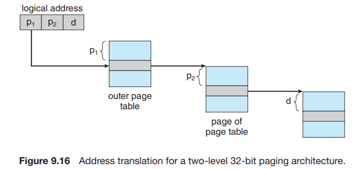

考虑这样做的好处：hierarchical paging 其实就是对页表的分页（page the page table）。因此，它避免了 page table 必须处在连续内存的问题，这一问题在 _p_ 比较大时尤其严重。

另外，这样做在一般情况下可以节省空间。我们之前提到，页表不一定会全部使用；并且由于逻辑地址是连续的，因此用到的页表项也是连续的，都排在页表的头部。因此如果我们采用了二级页表，那么许多排在后面的 inner page table 将完全为空；此时我们可以直接不给这些 inner page table 分配空间，即我们只分配最大的 p1 那么多个 inner page table。这样我们可以节省很多空间。即使在最差的情况下，所有页表都被使用了，我们的页表所用的总条目数也只有 $2^{p_1}+2^{p_1}\cdot 2^{p_2} = 2^{p_1} + 2^{p_1 + p_2}$ 个，只比单级页表结构多了 $2^{p_1}$，是完全可以接受的。

类似地，我们可以设计更多级的页表。例如，64 位的逻辑地址空间使用二级页表就是不够的，否则它的页表就会长成这样：

这样 outer page 就会超级大。我们可以 page the outer page：

这样，我们就建立了一个三级页表。

实际上，我们不必使用全部的 64 位，即我们不需要一个 64 位那么巨大的 virtual address space。AMD-64 支持 48-bit 的虚拟地址，ARM64 支持 39-bit 和 48-bit 的虚拟地址空间：

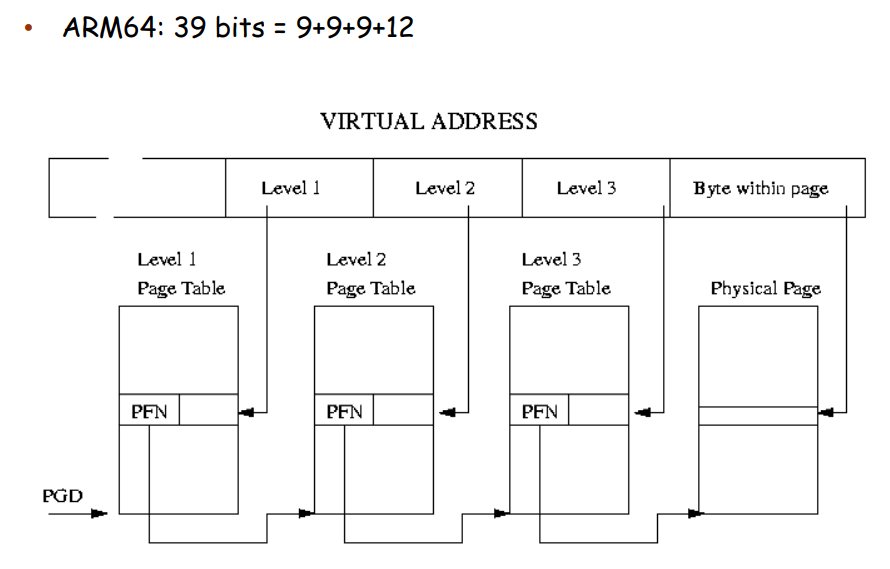

### 5.5.5 使用 TLB 加快地址转换
我们之前提到，使用页表时，我们根据 virtual page number 找到对应 page table entry 在 page table 中的偏移，然后与 page table register 相加得到对应 entry 的 physical address，从中读取对应的 entry。但是这种方法的效率存在问题。要访问 virtual address 对应的 physical address，我们首先要根据 page table register 和 page number 来找到页表在内存的位置，并在其中得到 page 对应的 frame number，这需要一次内存访问；然后我们根据 frame number 和 page offset 算出真实的 physical address，并访问对应的字节内容。即，访问一个字节需要两次内存访问，这会加倍原本的内存访问的时间，这是难以接受的。

这个问题的解决方法用到一个专用的高速查找硬件 cache，这里称它为 **translation look-aside buffer (TLB)**。它实际上就是 page table 的专用 cache（它真的是 cache；page table 并不是 cache，只是像 cache），其 associativity 的设计可以根据实际情况决定。

下图是一个 fully-associative 的 TLB 的例子；由于是 fully-associative，并不需要 index：

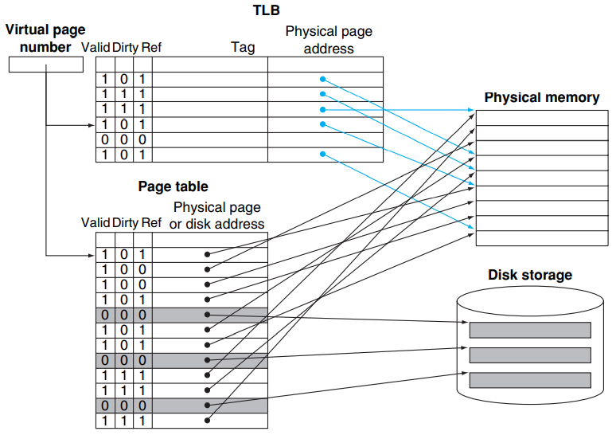

当 TLB miss 的时候，处理器去 page table 查找对应的项；如果发现对应项是 valid 的，那么就把他拿到 TLB 里（此时被替换掉的 TLB entry 的 dirty bit 如果是 1，也要写会 page table）；否则就会触发一个 page fault，然后在做上述的事。

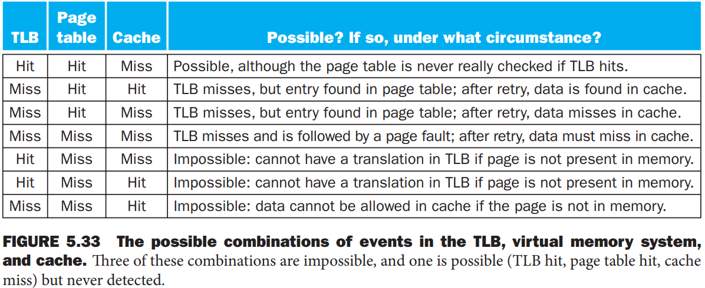

### 5.5.6 Memory Protection
暂时不想学QWQ

## 5.6 The Three Cs | 对 cache miss 的归类

!!! danger
    此处内容存疑

- Compulsory misses / Cold-start misses：对一个块第一次访问时引发的 miss
- Capacity misses：在 fully-associative cache 中，某个块虽然访问过，但是由于容量不够被换出去了，再访问时就 miss 了
- Conflict misses / Collision misses：在 set-associative 或 direct-mapped cache 中，某个块虽然访问过，但是由于这个组里的容量不够被换出去了，再访问时就 miss 了

## 5.7 Using FSM to Control a Simple Cache
FSM，Finite State Machine，有限状态自动机；其实就是根据当前状态和输入转换状态的东西。这里根据当前的状态以及发生的事件转换状态，并给出一些控制信号的输出：

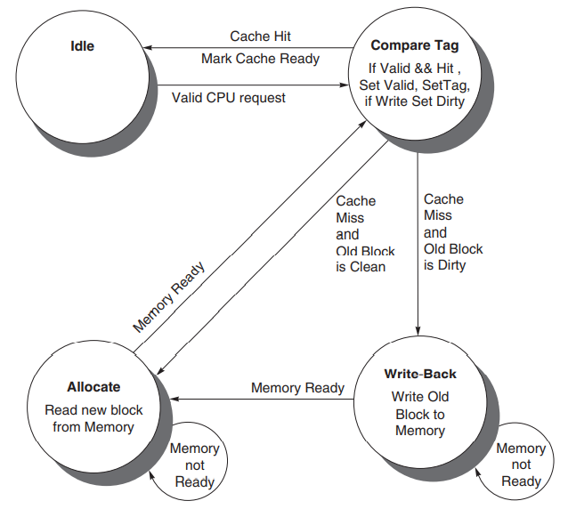

